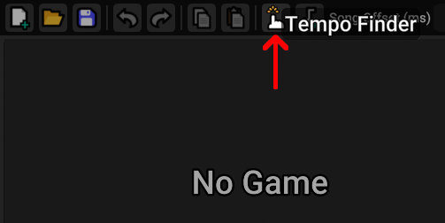
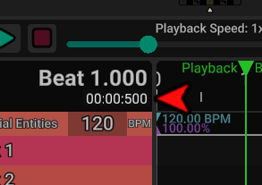
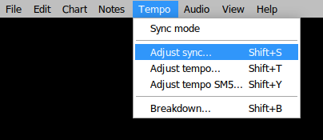
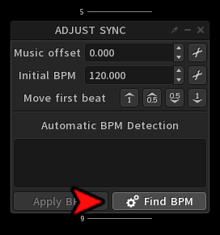
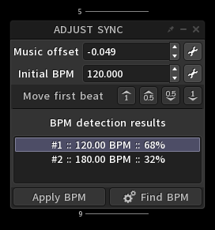

# Preparing your Song

## File Format

Heaven Studio supports multiple file formats for songs.

Any of the following will work, but it is recommended you use `.ogg` files if at all possible.

|Format|Details|
|:-:|:--|
|.ogg|Small file size with relatively good sound quality.
|.wav|Much larger file size, but very high sound quality.
|.aiff|Similar in size and quality to `.wav`, but less common.
|.mp3|Low sound quality. Converted to `.wav` by Heaven Studio, so there are no benefits.

For best results, you should acquire the highest quality file of your song that you can, then convert to one of the above formats for use in Heaven Studio.
These files will often be in `.flac` format, which can store a large amount of sound data and is ideal for conversion.

This page's author recommends [Audacity](https://www.audacityteam.org/), [freac](https://www.freac.org/), or [Sound Converter](https://soundconverter.org/) (Linux) for file conversion.
Online file converters do exist, but can often result in extra compression or quality loss, so be careful when using them.

## BPM and Offset

### Tempo Finder

Heaven Studio has a built-in Tempo Finder tool, used to deduce the BPM of a song by the user tapping in rhythm as it plays.

Offset can be tricker to find. As far as manual approaches go, this page's author recommends the following:

Check how many milliseconds into the song your first "beat marker" is in Heaven Studio. Then load your song into Audacity (or any similar audio editing software), and check how many milliseconds in the first audible beat of the song is. Subtract the second time from the first to get your offset. Make adjustments to further increase the accuracy by using the Metronome tool to check for any slight error.

### Other Tools

Another option for finding your BPM is to use external software, such as [ArrowVortex](https://arrowvortex.ddrnl.com/).
ArrowVortex is a tool for creating DDR/ITG charts, but is insanely useful for any rhythm game charter for it's BPM and offset tools, as well as others.

To find the BPM and offset of a song using ArrowVortex, use the Adjust Sync menu.

Select "Find BPM" to activate the BPM Detection.
ArrowVortex may suggest multiple BPM options, sorted by how likely they are. The topmost option will usually be the most accurate.
The Adjust Sync menu will also provide the correct offset for your song, after pressing the "Apply BPM" button.

To use the offset from ArrowVortex in Heaven Studio, multiply it by 1000 (so an offset of -0.049 becomes -49).

Make adjustments to further increase the accuracy by using the Metronome tool to check for any slight error.
